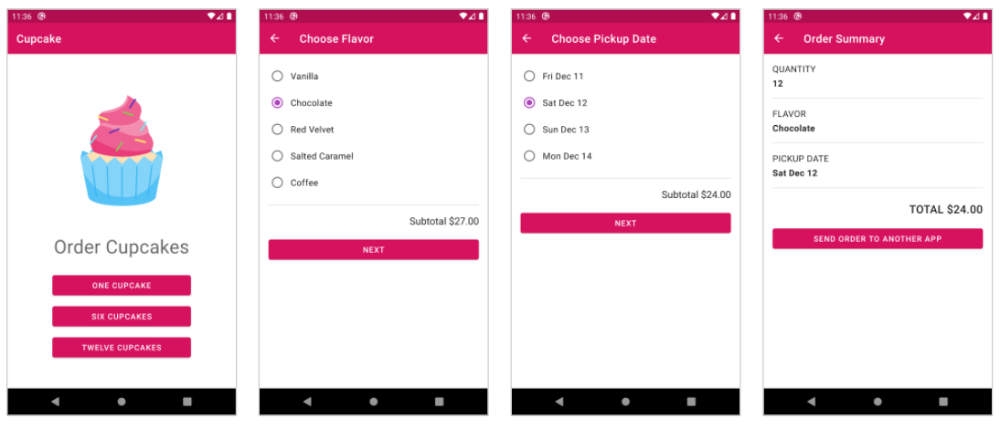

# Cupcake app

This app demonstrates `Multiple Fragments in an Activity`, a `Shared ViewModel` across
fragments,  `Data Binding`, `LiveData`, and the `Jetpack Navigation Component`.

**To work with those:**

- Go to app-module level gradle file
- Add followings:

``` 
// For data binding
android {
	buildFeatures {  
	  dataBinding true  
	}
}

// For navigation component
def nav_version = "2.3.5"  
implementation "androidx.navigation:navigation-fragment-ktx:$nav_version"  
implementation "androidx.navigation:navigation-ui-ktx:$nav_version"

// For livedata
def lifecycle_version = "2.4.0"
implementation "androidx.lifecycle:lifecycle-livedata-ktx:$lifecycle_version"  
implementation "androidx.lifecycle:lifecycle-viewmodel-ktx:$lifecycle_version"  
implementation "androidx.lifecycle:lifecycle-viewmodel-savedstate:$lifecycle_version"
``` 

